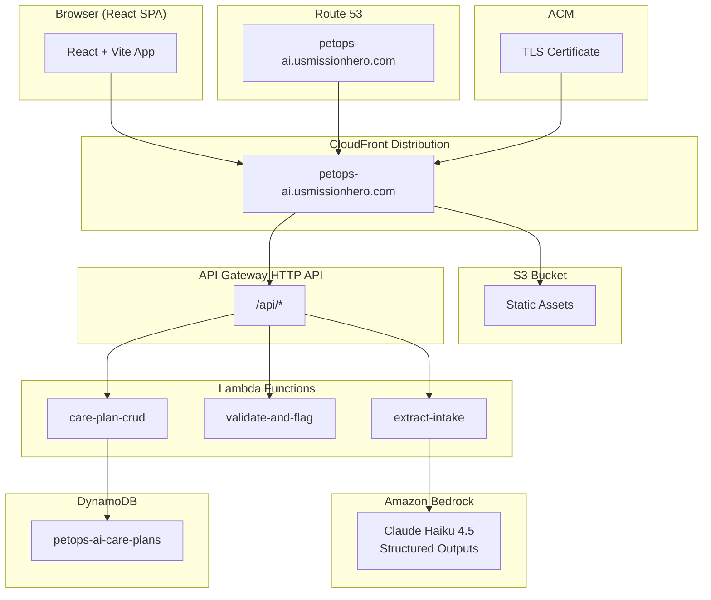
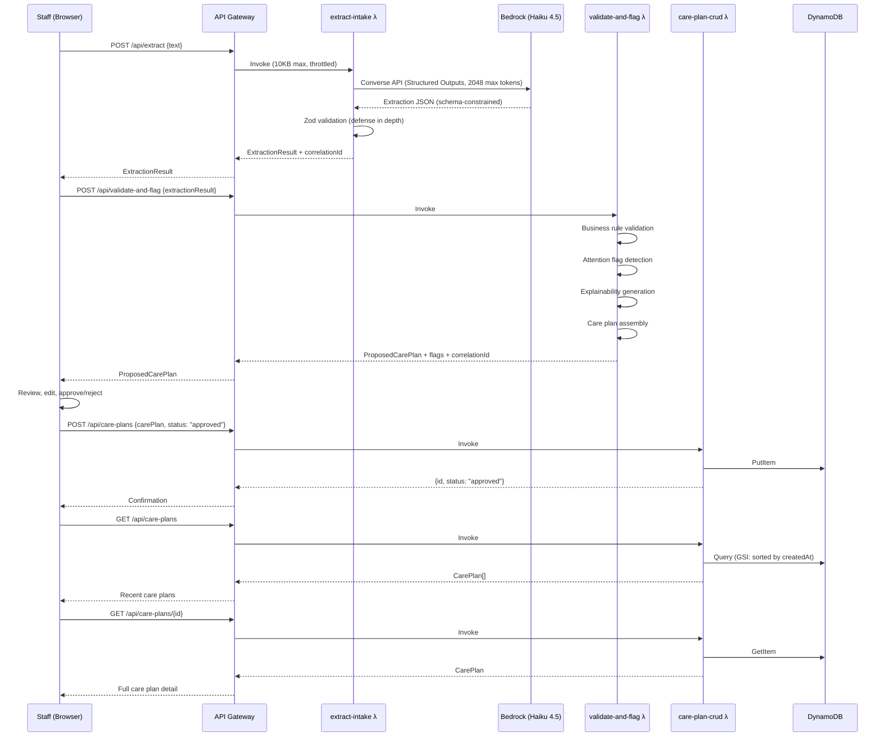

# Design Document: PetOps AI Platform

## Overview

PetOps AI is a serverless AWS application that transforms unstructured customer requests into structured, validated care plans for pet-care businesses. The system implements a flagship pipeline: **Intake → AI Extraction → Deterministic Validation → Operational Attention Detection → Care Plan Assembly → Human Review → Persistent Record**.

The architecture enforces a strict trust boundary: AI output is treated as untrusted external input. Even with Bedrock Structured Outputs enforcing JSON schema at the model level, local Zod validation remains mandatory (defense in depth). All flagging logic is deterministic and operational — never clinical.

### Key Design Decisions

- **Single-pet MVP**: One intake → one primary pet → one analysis → one care plan
- **Operations assistant, not veterinary system**: No medication interactions, no medical safety, no jurisdiction-specific vaccination inference
- **Structured Outputs + Local Validation**: Two layers of schema enforcement
- **Interactive failure recovery**: At most one automatic retry, then explicit manual action
- **No authentication**: Hackathon demo with fictional data, protected by throttling and budget alerts

## Architecture

### System Architecture Diagram



### Pipeline Sequence Diagram



### Trust Boundary Pipeline

```
UNTRUSTED                         TRUST BOUNDARY                         TRUSTED
──────────────────────────────────────────────────────────────────────────────────
Customer text (1-5000 chars)  →   API Gateway (10KB, throttle)      →   Validated request
                                         ↓
                                  Bedrock Structured Output          →   Schema-constrained JSON
                                  (model-level JSON schema)
                                         ↓
AI Output (JSON)              →   Local Zod Validation              →   Validated ExtractionResult
                                         ↓
                                  Business Rule Validation           →   Rule-checked extraction
                                  (deterministic, exhaustive)
                                         ↓
                                  Attention Detection                →   Flagged extraction
                                  (deterministic rules only)
                                         ↓
                                  Care Plan Assembly                 →   Proposed Care Plan
                                  (deterministic)
                                         ↓
                                  Human Review (approve/reject)      →   Approved Plan
                                         ↓
                                  DynamoDB PutItem                   →   Operational Record
```

## Components and Interfaces

### Lambda Functions

#### 1. `extract-intake` (30s timeout, 256MB)

**Purpose**: Receives customer request text, invokes Bedrock for AI extraction, validates the response locally, returns structured extraction result.

**API Contract**:
```
POST /api/extract
```

**Request**:
```typescript
interface ExtractRequest {
  text: string;           // 1-5000 characters, non-empty/non-whitespace
  correlationId?: string; // Optional client-provided; generated if absent
}
```

**Response (200)**:
```typescript
interface ExtractResponse {
  correlationId: string;
  extractionResult: ExtractionResult;
  processingTimeMs: number;
}
```

**Error Responses**:
- `400`: Invalid request (empty text, exceeds 5000 chars, fails schema)
- `422`: Extraction produced empty/invalid result after validation
- `503`: Bedrock unavailable after retry
- `504`: Bedrock timeout after 30s

**Behavior**:
1. Validate request body with Zod (text length, non-whitespace)
2. Generate correlationId if not provided
3. Invoke Bedrock Converse API with Structured Outputs (JSON schema constraint)
4. Validate AI response with local Zod schema (defense in depth)
5. If Bedrock returns transient error: retry once with 1s backoff
6. If retry fails or timeout: return error with correlationId and preserved text reference
7. Return validated ExtractionResult

#### 2. `validate-and-flag` (10s timeout, 256MB)

**Purpose**: Applies deterministic business rules, detects operational attention flags, generates explanations, assembles proposed care plan.

**API Contract**:
```
POST /api/validate-and-flag
```

**Request**:
```typescript
interface ValidateAndFlagRequest {
  extractionResult: ExtractionResult;
  originalText: string;
  correlationId: string;
}
```

**Response (200)**:
```typescript
interface ValidateAndFlagResponse {
  correlationId: string;
  validationResult: ValidationResult;
  attentionFlags: AttentionFlag[];
  proposedCarePlan: ProposedCarePlan;
}
```

**Error Responses**:
- `400`: Invalid request schema
- `422`: ExtractionResult fails validation (structural issues from malformed client data)

**Behavior**:
1. Validate request body with Zod
2. Run business rule validation (date logic, required fields per service type)
3. Collect ALL validation errors exhaustively (not stop-at-first)
4. Run attention flag detection (medication gaps, vaccination timing, behavioral, allergy)
5. Generate evidence-based explanations for each flag
6. Assemble proposed care plan with sections: pet info, services, schedules, medications, attention flags, special instructions
7. Return complete result

#### 3. `care-plan-crud` (10s timeout, 256MB)

**Purpose**: Persists approved care plans, retrieves by ID, lists recent plans.

**API Contracts**:

```
POST /api/care-plans          → Create/approve care plan
GET  /api/care-plans          → List recent care plans
GET  /api/care-plans/{id}     → Get care plan by ID
```

**Create Request**:
```typescript
interface CreateCarePlanRequest {
  originalRequest: string;
  extractionResult: ExtractionResult;
  attentionFlags: AttentionFlag[];
  carePlan: ApprovedCarePlan;
  status: "approved";
  correlationId: string;
}
```

**Create Response (201)**:
```typescript
interface CreateCarePlanResponse {
  id: string;              // UUIDv4
  status: "approved";
  createdAt: string;       // ISO 8601
  correlationId: string;
}
```

**List Response (200)**:
```typescript
interface ListCarePlansResponse {
  items: CarePlanSummary[];
  correlationId: string;
}

interface CarePlanSummary {
  id: string;
  petName: string;
  serviceType: string;
  status: string;
  createdAt: string;
}
```

**Get Response (200)**:
```typescript
interface GetCarePlanResponse {
  carePlan: StoredCarePlan;
  correlationId: string;
}
```

**Error Responses**:
- `400`: Invalid request body
- `404`: Care plan ID not found
- `503`: DynamoDB unavailable

### Frontend Components (React SPA)

| Component | Route | Purpose |
|-----------|-------|---------|
| LandingPage | `/` | Product name, value proposition, CTA |
| DemoShowcase | `/demo` | Guided demo with scenario selection |
| IntakeForm | `/app` | Text input with character counter, demo scenario buttons |
| ProcessingView | `/app` (state) | Loading indicator during extraction |
| ReviewPanel | `/app` (state) | Side-by-side original text + proposed plan, edit, approve/reject |
| CarePlanDetail | `/app/plans/:id` | Full stored care plan view |
| HistoryList | `/app/plans` | Recent care plans list with summary |
| ErrorBoundary | (wrapper) | Graceful error display with correlation ID and retry |

### Infrastructure Components (Terraform)

| Resource | Purpose |
|----------|---------|
| S3 Bucket | Static SPA hosting |
| CloudFront Distribution | CDN, SPA routing (403/404 → /index.html), HTTPS |
| Route 53 Record | petops-ai.usmissionhero.com → CloudFront |
| ACM Certificate | TLS for CloudFront (us-east-1) |
| API Gateway HTTP API | REST endpoints with throttling, CORS, 10KB limit |
| Lambda × 3 | extract-intake, validate-and-flag, care-plan-crud |
| IAM Roles × 3 | Least-privilege per function |
| DynamoDB Table | petops-ai-care-plans (on-demand) |
| CloudWatch Log Groups | 14-day retention per Lambda |
| AWS Budget | $10/month with 50%, 80%, 100% alerts |

## Data Models

### ExtractionResult (AI Output Schema)

```typescript
interface ExtractionResult {
  pet: PetInfo;
  services: ServiceRequest[];
  medications: MedicationEntry[];
  allergies: string[];
  behavioralConcerns: string[];
  feedingInstructions: string | null;
  vaccinations: VaccinationEntry[];
  specialInstructions: string | null;
  overallCompleteness: "complete" | "partial" | "incomplete";
}

interface PetInfo {
  name: string | null;
  species: string | null;
  breed: string | null;
  age: string | null;
  weight: string | null;
  uncertainFields: string[];  // field names that are uncertain
}

interface ServiceRequest {
  type: "boarding" | "grooming" | "daycare" | "sitting";
  startDate: string | null;     // ISO 8601 date
  endDate: string | null;       // ISO 8601 date
  checkInTime: string | null;   // HH:mm
  checkOutTime: string | null;  // HH:mm
  uncertainFields: string[];
}

interface MedicationEntry {
  name: string;
  dosage: string | null;
  frequency: string | null;
  route: string | null;
  instructions: string | null;
  uncertainFields: string[];
}

interface VaccinationEntry {
  name: string;
  expirationDate: string | null;  // ISO 8601 date
  uncertainFields: string[];
}
```

### ValidationResult

```typescript
interface ValidationResult {
  status: "passed" | "failed";
  errors: ValidationError[];
}

interface ValidationError {
  fieldPath: string;       // dot-notation path e.g. "services[0].startDate"
  rule: string;            // machine-readable rule ID
  message: string;         // human-readable description
}
```

### AttentionFlag

```typescript
interface AttentionFlag {
  id: string;                           // UUIDv4
  severity: "high" | "medium" | "low";
  category: "medication_gap" | "vaccination_timing" | "behavioral" | "allergy";
  title: string;                        // short summary
  explanation: string;                  // 1-3 sentence evidence-based explanation
  sourceText: string;                   // relevant fragment from original request
  fieldPath: string;                    // reference to triggering field
}
```

### ProposedCarePlan

```typescript
interface ProposedCarePlan {
  sections: {
    petInformation: PetInfo;
    services: ServiceRequest[];
    schedules: DailySchedule[];
    medications: MedicationScheduleEntry[];
    attentionFlags: AttentionFlag[];
    specialInstructions: string[];
  };
  validationResult: ValidationResult;
  missingFields: MissingFieldPlaceholder[];
  uncertainFieldCount: number;
}

interface DailySchedule {
  date: string;           // ISO 8601
  entries: ScheduleEntry[];
}

interface ScheduleEntry {
  time: string;           // HH:mm
  type: "medication" | "feeding" | "service";
  description: string;
}

interface MedicationScheduleEntry {
  medicationName: string;
  time: string;           // HH:mm
  dosage: string;
  instructions: string;
}

interface MissingFieldPlaceholder {
  fieldPath: string;
  label: string;
  requiredFor: string;    // which service type requires this
}
```

### StoredCarePlan (DynamoDB Record)

```typescript
interface StoredCarePlan {
  id: string;                    // UUIDv4 (partition key)
  status: "draft" | "approved" | "rejected";
  createdAt: string;             // ISO 8601 (GSI sort key)
  updatedAt: string;             // ISO 8601
  decisionAt: string | null;     // ISO 8601, null until approve/reject
  originalRequest: string;       // preserved customer text
  extractionResult: ExtractionResult;
  attentionFlags: AttentionFlag[];
  carePlan: ApprovedCarePlan;
  correlationId: string;
  petName: string;               // denormalized for list view
  serviceType: string;           // denormalized for list view
}
```

### DynamoDB Table Design

```
Table: petops-ai-care-plans
  Partition Key: id (String, UUIDv4)

GSI: createdAt-index
  Partition Key: status (String)
  Sort Key: createdAt (String, ISO 8601)
  Projection: id, petName, serviceType, status, createdAt
```

**Access Patterns**:
1. **Get by ID**: `GetItem(PK=id)` — primary lookup
2. **List recent**: `Query(GSI, PK="approved", ScanIndexForward=false, Limit=20)` — dashboard
3. **Update status**: `UpdateItem(PK=id, SET status, updatedAt, decisionAt)` — approve/reject

### Bedrock Converse API Configuration

```typescript
const converseParams = {
  modelId: "us.anthropic.claude-haiku-4-5-20251001-v1:0",
  messages: [
    { role: "user", content: [{ text: systemPrompt + customerRequest }] }
  ],
  inferenceConfig: {
    maxTokens: 2048,
    temperature: 0.0,  // deterministic extraction
  },
  outputConfig: {
    textFormat: {
      format: "json",
      schema: extractionResultJsonSchema  // JSON Schema Draft 2020-12
    }
  }
};
```

### API Gateway Configuration

```
HTTP API: petops-ai-api
  Stage: $default (auto-deploy)
  Throttling: burst=10, rate=5
  CORS: origin=https://petops-ai.usmissionhero.com, methods=GET,POST,OPTIONS
  Routes:
    POST /api/extract → extract-intake Lambda
    POST /api/validate-and-flag → validate-and-flag Lambda
    POST /api/care-plans → care-plan-crud Lambda
    GET  /api/care-plans → care-plan-crud Lambda
    GET  /api/care-plans/{id} → care-plan-crud Lambda
  Payload format: 2.0
  Max request body: 10KB (via Lambda validation — API GW HTTP API doesn't natively enforce)
```


## Correctness Properties

*A property is a characteristic or behavior that should hold true across all valid executions of a system — essentially, a formal statement about what the system should do. Properties serve as the bridge between human-readable specifications and machine-verifiable correctness guarantees.*

Note: Properties below apply to the **deterministic logic layers** (validation, attention detection, care plan assembly, API handling). Infrastructure (Terraform), UI rendering, and AI extraction behavior are tested via snapshot tests, example-based tests, and curated integration scenarios respectively.

### Property 1: Customer Request Input Validation

*For any* string input, the intake validation function SHALL accept the string if and only if it contains at least one non-whitespace character AND its length is between 1 and 5000 characters inclusive. All other strings (empty, whitespace-only, or exceeding 5000 characters) SHALL be rejected with a validation error.

**Validates: Requirements 1.1, 1.2, 1.6**

### Property 2: ExtractionResult Schema Validation Round-Trip

*For any* valid ExtractionResult object conforming to the defined schema, Zod validation SHALL return the object unchanged with status "passed". *For any* object that violates the schema (wrong types, missing required fields, invalid enum values), Zod validation SHALL reject it with one or more structured errors.

**Validates: Requirements 2.6, 3.1, 3.6, 13.3**

### Property 3: Date Range Business Rule

*For any* ServiceRequest containing both a startDate and endDate, the validation layer SHALL produce a date-range error if and only if the endDate is strictly earlier than the startDate (chronologically). Valid or equal date ranges SHALL NOT produce this error.

**Validates: Requirements 3.2**

### Property 4: Required Fields Per Service Type

*For any* ExtractionResult with a ServiceRequest of a given type, the validation layer SHALL identify exactly the set of required fields that are null or missing — where boarding requires {petName, startDate, endDate}, grooming requires {petName, startDate}, daycare requires {petName, startDate}, and sitting requires {petName, startDate, endDate}. No false positives (flagging present fields) or false negatives (missing absent required fields) SHALL occur.

**Validates: Requirements 3.3**

### Property 5: Validation Determinism

*For any* ExtractionResult, executing the validation layer twice with identical input SHALL produce identical output (same errors, same status, same field paths).

**Validates: Requirements 3.4**

### Property 6: Exhaustive Error Reporting

*For any* ExtractionResult containing N distinct validation violations (N ≥ 2), the validation layer SHALL report exactly N errors in its output — never stopping at the first violation or reporting duplicates.

**Validates: Requirements 3.5**

### Property 7: Attention Flag Detection Completeness and Severity

*For any* validated ExtractionResult:
- Each medication entry with missing schedule, ambiguous frequency, incomplete dosage, ambiguous route, contradictory instructions, or duplicate entries SHALL produce a HIGH severity flag.
- Each vaccination entry whose stated expiration date falls on or before the service end date SHALL produce a MEDIUM severity flag.
- Each behavioral concern entry SHALL produce a MEDIUM severity flag.
- Each allergy entry SHALL produce a LOW severity flag.
- If none of these conditions exist, the flag list SHALL be empty.

No flag SHALL contain clinical claims about medication interactions, veterinary eligibility, or medical safety.

**Validates: Requirements 4.1, 4.2, 4.3, 4.4, 4.5, 4.6, 4.7**

### Property 8: Explanation Format and Source Reference

*For any* generated AttentionFlag, the explanation field SHALL contain between 1 and 3 sentences (delimited by sentence-ending punctuation), and the sourceText field SHALL be a non-empty string.

**Validates: Requirements 5.1, 5.2**

### Property 9: Care Plan Assembly Completeness

*For any* valid ExtractionResult and its associated AttentionFlags, the assembled ProposedCarePlan SHALL contain: (a) all pet information fields from the extraction, (b) all service requests, (c) all attention flags with their severity, explanation, and sourceText preserved, (d) all six named sections (petInformation, services, schedules, medications, attentionFlags, specialInstructions).

**Validates: Requirements 6.1, 6.2, 6.5**

### Property 10: Medication Timeline Chronological Ordering

*For any* set of medication entries with administration times, the care plan's medication schedule SHALL be ordered chronologically by time within each day. For entries on the same day, earlier times SHALL appear before later times.

**Validates: Requirements 6.3**

### Property 11: Missing Field Placeholders

*For any* ValidationResult identifying N missing required fields, the assembled ProposedCarePlan SHALL contain exactly N MissingFieldPlaceholder entries, each referencing the correct field path, a human-readable label, and the service type that requires it.

**Validates: Requirements 6.4**

### Property 12: Care Plan Storage Round-Trip

*For any* valid StoredCarePlan object, storing it in DynamoDB and then retrieving it by the assigned ID SHALL return data equivalent to the original (all fields preserved including originalRequest, extractionResult, attentionFlags, and carePlan content).

**Validates: Requirements 8.1, 8.4**

### Property 13: Stored Record Format Invariants

*For any* newly stored care plan record, the assigned ID SHALL match the UUIDv4 format (`/^[0-9a-f]{8}-[0-9a-f]{4}-4[0-9a-f]{3}-[89ab][0-9a-f]{3}-[0-9a-f]{12}$/i`), and the createdAt and updatedAt fields SHALL be valid ISO 8601 datetime strings.

**Validates: Requirements 8.2, 8.3**

### Property 14: API Input Validation Gate

*For any* API request body that fails schema validation (wrong types, missing required fields) OR exceeds 10KB in size, the API handler SHALL reject the request with a structured error response and SHALL NOT invoke downstream processing (no Bedrock call, no DynamoDB write).

**Validates: Requirements 13.1, 13.6**

### Property 15: XSS Encoding Safety

*For any* user-provided string containing HTML special characters (`<`, `>`, `"`, `'`, `&`) or common XSS payloads, the encoding function SHALL produce an output where those characters are entity-escaped or removed, preventing script execution when rendered in HTML context.

**Validates: Requirements 13.4**

### Property 16: Correlation ID Presence

*For any* API response (success or error), the response body SHALL contain a non-empty `correlationId` field that is a valid string identifier.

**Validates: Requirements 14.6**

### Property 17: Uncertainty Classification and Count

*For any* ExtractionResult, the `uncertainFieldCount` in the ProposedCarePlan SHALL equal the total count of entries across all `uncertainFields` arrays in the ExtractionResult (summing pet.uncertainFields, each service's uncertainFields, each medication's uncertainFields, and each vaccination's uncertainFields).

**Validates: Requirements 15.1, 15.4**

## Error Handling

### Error Categories and Responses

| Error Type | HTTP Status | User Message | System Action |
|------------|-------------|--------------|---------------|
| Invalid request body | 400 | "Please check your input and try again" | Return structured validation errors |
| Empty/whitespace text | 400 | "Please enter a customer request" | Prevent submission (client-side) |
| Request too large | 400 | "Request exceeds maximum size" | Reject before processing |
| Bedrock timeout | 504 | "Processing took too long. Please try again." | Preserve text, show Retry button |
| Bedrock transient error | 503 | "Service temporarily unavailable" | Auto-retry once (1s backoff), then show manual Retry |
| Bedrock schema compilation | 500 | "An error occurred processing your request" | Log error, fall back to prompt-based extraction |
| AI output fails validation | 422 | "Could not extract information. Please try again or rephrase." | Reject extraction, offer retry |
| DynamoDB unreachable | 503 | "Unable to save right now. Your plan is preserved locally." | Preserve in client session, offer retry |
| Care plan not found | 404 | "Care plan not found" | Return structured not-found error |
| Throttled | 429 | "Too many requests. Please wait a moment." | API Gateway returns 429 |

### Retry Strategy

```
Bedrock Call:
  ┌─ Attempt 1 (up to 30s timeout)
  │   Success → return result
  │   Transient error → wait 1s
  │
  ├─ Attempt 2 (automatic retry)
  │   Success → return result
  │   Any error → surface to user
  │
  └─ User sees: error message + correlationId + manual "Retry" button
     Original text is ALWAYS preserved (never lost)
```

### Correlation ID Flow

Every request entering the system receives or inherits a correlation ID that propagates through all stages:

```
Client Request (optional correlationId)
  → API Gateway (pass-through)
    → Lambda (generate if absent, log with ID)
      → Bedrock call (logged with ID)
      → DynamoDB operation (logged with ID)
    → Response (always includes correlationId)
  → Client (display in errors for support)
```

### Client-Side Error Resilience

- Original customer request text is preserved in component state through all error flows
- On rejection: text is passed back to intake form pre-populated
- On DynamoDB failure: proposed care plan preserved in session storage
- On network failure: error boundary catches, displays message, offers retry/return
- All error displays include correlation ID for diagnostics

## Testing Strategy

### Dual Testing Approach

This system uses both **deterministic unit/property tests** and **integration tests**, with clear separation:

| Test Type | What It Tests | Frequency | Tools |
|-----------|---------------|-----------|-------|
| Property-based tests | Validation logic, attention detection, care plan assembly, input handling | Every commit | fast-check (TypeScript) |
| Unit tests (example-based) | Specific scenarios, edge cases, error paths, UI components | Every commit | Vitest + React Testing Library |
| Contract/scenario tests | AI extraction with known inputs → schema-conforming outputs | Manual/nightly | Vitest + live Bedrock |
| Integration tests | End-to-end API flows, DynamoDB operations | Manual/pre-deploy | Vitest + AWS SDK mocks |
| Accessibility tests | WCAG 2.1 AA compliance | Every commit | axe-core + manual audit |
| Infrastructure tests | Terraform plan validation | Pre-deploy | terraform plan + validate |

### Property-Based Testing Configuration

- **Library**: [fast-check](https://github.com/dubzzz/fast-check) (TypeScript)
- **Minimum iterations**: 100 per property
- **Tag format**: `Feature: petops-ai-platform, Property {N}: {property_text}`

Properties 1–17 from the Correctness Properties section map directly to property-based tests. Each property test generates random valid/invalid inputs and verifies the universal invariant holds.

**Key generators needed**:
- `arbitraryExtractionResult()` — generates random valid ExtractionResult objects
- `arbitraryInvalidExtractionResult()` — generates structurally invalid objects
- `arbitraryMedicationEntry()` — with random gaps/completeness
- `arbitraryServiceRequest(type)` — with random field presence per service type
- `arbitraryDatePair()` — random start/end date pairs (valid and invalid)
- `arbitraryAttentionFlag()` — random flags with varied severity/category
- `arbitraryCustomerRequestText()` — random strings of varying length and content

### Unit Test Focus Areas

- **Validation layer**: Fixed input → expected error list (complement to property tests)
- **Attention detection**: Specific medication gap scenarios, vaccination date edge cases
- **Care plan assembly**: Known extraction → expected plan structure
- **API handlers**: Request parsing, error formatting, response structure
- **React components**: Render tests for each view state (loading, success, error, empty)
- **Demo scenarios**: Verify each scenario (Bentley, Luna, Cooper) produces expected extraction

### Integration Test Focus Areas

- **Bedrock extraction**: 3-5 curated scenarios with known inputs, verify schema conformance
- **DynamoDB CRUD**: Store/retrieve/list with real (local) DynamoDB
- **API Gateway routing**: Verify routes resolve to correct Lambda functions
- **End-to-end pipeline**: Submit text → extract → validate → flag → assemble → review → approve → retrieve

### What We Do NOT Property-Test

- Terraform/IaC configurations (use `terraform validate` and plan inspection)
- React component rendering (use snapshot tests and React Testing Library)
- AI model output quality (use curated scenario tests with known inputs)
- CloudFront routing behavior (use deployment verification)
- Authentication (none exists in this demo)
